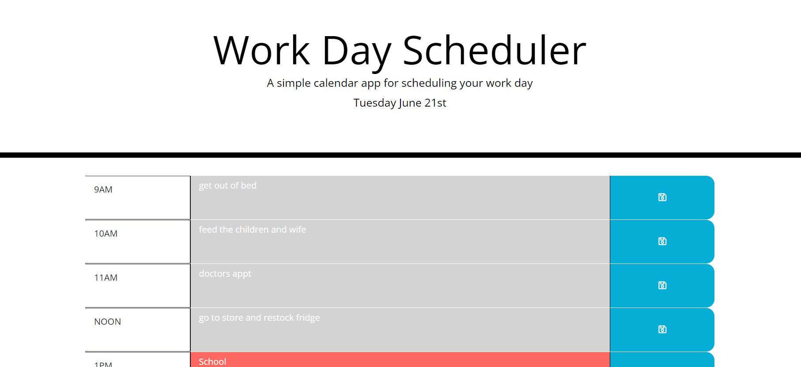

# work-day-scheduler

## brief description

This work day scheduler lets users plan their day and visualize the progression of the day while it goes on. The user can enter their tasks in each time slot and save them using the buttons provided, which is locally saved. The user can then close out of the page and return at a later time to see how their day is going and if they are on track for the rest of their objectives! 

## Screenshot

## github repository

https://github.com/Ryan-Buckley1/work-day-scheduler

## live site 

https://ryan-buckley1.github.io/work-day-scheduler/